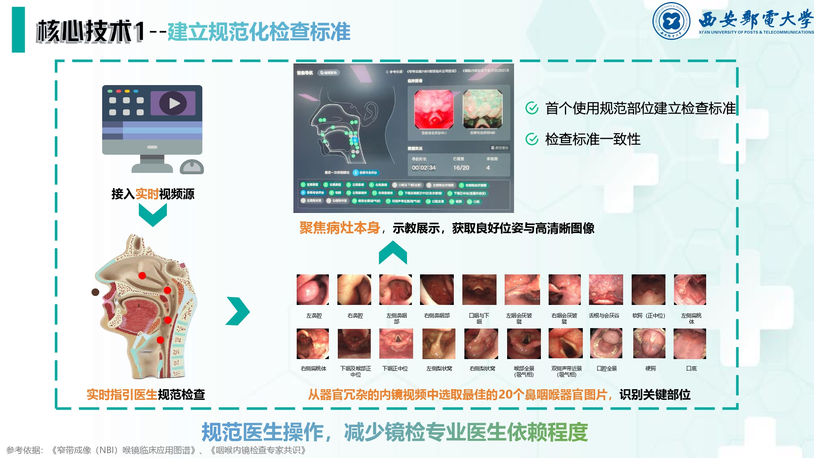

在人工智能快速发展的今天，我们团队推出一款鼻咽喉内窥镜智能检测辅助系统。 
首先，在医生进行鼻咽喉部位检测中，规范检查过程中技师的操作，进行窄带图像生成(Narrow Band Imaging)NBI。借助人工智能技术，对于原始视频中器官进行全自动挑选图像。本产品借助深度学习与图像处理等算法，对图像进行预处理工作，主要包括：预冻结功能、去除反射与高亮(FAST Marching Method)FMM与图像筛选功能。最后，构建鼻咽喉器官与病灶组织数据集，在利用训练好的分类模型与分割模型对预处理后的图像进行器官识别，和病变组织精准分割。从而实现鼻咽喉病灶精准定位和识别，并自动生成检查报告，满足鼻咽喉临床需求。 
在医疗资源紧缺、医患矛盾突出的今天，本产品能显著提高电子内镜检查的效率和准确率，减小鼻咽喉检测设备依赖，大大提高医生的工作效率，降低患者的等待时间，辅助医生真正做到一目了然，让病灶无处可藏。真正达到早发现、早诊断、早治疗、早恢复的目的。
下面是介绍视频:

<video src="./img/freecompress-演示视频.mp4"></video>

https://github.com/user-attachments/assets/8353fe61-e252-4cd6-b1b2-d789965716db

